# アーキテクチャ設計書

このドキュメントは、minitoolsプロジェクトのシステムアーキテクチャを説明します。

## システム概要

minitoolsは、複数のソースからコンテンツを収集し、Ollama LLMで処理して、NotionやSlackに出力する自動化フレームワークです。

```mermaid
flowchart TB
    subgraph Sources["データソース"]
        ArXiv["ArXiv API"]
        Gmail["Gmail API"]
        YouTube["YouTube"]
        NotionDB["Notion Database"]
        TwitterAPI["TwitterAPI.io"]
    end

    subgraph Collectors["収集レイヤー"]
        AC["ArxivCollector"]
        MC["MediumCollector"]
        GAC["GoogleAlertsCollector"]
        YC["YouTubeCollector"]
        XTC["XTrendCollector"]
    end

    subgraph Readers["読み取りレイヤー"]
        NR["NotionReader"]
    end

    subgraph Researchers["リサーチレイヤー"]
        TrendR["TrendResearcher"]
    end

    subgraph Scrapers["スクレイピングレイヤー"]
        MS["MediumScraper"]
        MDC["MarkdownConverter"]
        AS["ArxivScraper"]
    end

    subgraph LLMLayer["LLM抽象化レイヤー"]
        LLMFactory["get_llm_client()"]
        OC["OllamaClient"]
        OpenAIC["OpenAIClient"]
        GeminiC["GeminiClient"]
    end

    subgraph Processors["処理レイヤー"]
        TR["Translator"]
        SU["Summarizer"]
        FTT["FullTextTranslator"]
        VPR["VlmParseRepairer"]
        WDP["WeeklyDigestProcessor"]
        AWP["ArxivWeeklyProcessor"]
        XTP["XTrendProcessor"]
        DD["DuplicateDetector"]
    end

    subgraph EmbeddingLayer["Embedding抽象化レイヤー"]
        EmbFactory["get_embedding_client()"]
        OllamaEmb["OllamaEmbeddingClient"]
        OpenAIEmb["OpenAIEmbeddingClient"]
    end

    subgraph Publishers["出力レイヤー"]
        NP["NotionPublisher"]
        NBB["NotionBlockBuilder"]
        SP["SlackPublisher"]
    end

    subgraph Outputs["出力先"]
        Notion["Notion Database"]
        Slack["Slack Channel"]
    end

    ArXiv --> AC
    Gmail --> MC
    Gmail --> GAC
    YouTube --> YC
    NotionDB --> NR
    TwitterAPI --> XTC

    AC --> TR
    MC --> TR
    GAC --> TR
    YC --> SU
    NR --> WDP
    XTC --> XTP

    MS --> MDC
    MDC --> FTT
    FTT <--> LLMFactory
    FTT --> NBB
    NBB --> NP

    ArXiv --> AS
    AS --> VPR
    VPR <--> LLMFactory
    AS --> FTT

    LLMFactory --> OC
    LLMFactory --> OpenAIC
    LLMFactory --> GeminiC
    TR <--> OC
    SU <--> OC
    WDP <--> LLMFactory
    WDP --> DD
    AWP <--> LLMFactory
    AWP --> TrendR
    DD <--> EmbFactory
    EmbFactory --> OllamaEmb
    EmbFactory --> OpenAIEmb

    TR --> NP
    TR --> SP
    SU --> NP
    SU --> SP
    WDP --> SP
    AWP --> SP
    XTP --> SP

    NP --> Notion
    SP --> Slack
```

## モジュール依存関係

```mermaid
flowchart TB
    subgraph scripts["scripts/"]
        arxiv["arxiv.py"]
        medium["medium.py"]
        medium_translate["medium_translate.py"]
        arxiv_translate["arxiv_translate.py"]
        google_alerts["google_alerts.py"]
        youtube["youtube.py"]
        google_alert_weekly_digest["google_alert_weekly_digest.py"]
        arxiv_weekly["arxiv_weekly.py"]
        x_trend["x_trend.py"]
    end

    subgraph collectors["minitools/collectors/"]
        AC["ArxivCollector"]
        MC["MediumCollector"]
        GAC["GoogleAlertsCollector"]
        YC["YouTubeCollector"]
        XTC["XTrendCollector"]
    end

    subgraph scrapers["minitools/scrapers/"]
        MS["MediumScraper"]
        MDC["MarkdownConverter"]
        AS["ArxivScraper"]
    end

    subgraph processors["minitools/processors/"]
        TR["Translator"]
        SU["Summarizer"]
        FTT["FullTextTranslator"]
        VPR["VlmParseRepairer"]
        WDP["WeeklyDigestProcessor"]
        AWP["ArxivWeeklyProcessor"]
        XTP["XTrendProcessor"]
        DD["DuplicateDetector"]
    end

    subgraph researchers["minitools/researchers/"]
        TrendR["TrendResearcher"]
    end

    subgraph publishers["minitools/publishers/"]
        NP["NotionPublisher"]
        NBB["NotionBlockBuilder"]
        SP["SlackPublisher"]
    end

    subgraph utils["minitools/utils/"]
        Config["Config"]
        Logger["Logger"]
    end

    arxiv --> AC
    arxiv --> TR
    arxiv --> NP
    arxiv --> SP

    medium --> MC
    medium --> TR
    medium --> NP
    medium --> SP
    medium --> MS
    medium --> FTT
    medium --> NBB

    medium_translate --> MS
    medium_translate --> MDC
    medium_translate --> FTT
    medium_translate --> NBB
    medium_translate --> NP

    arxiv_translate --> AS
    arxiv_translate --> VPR
    arxiv_translate --> FTT
    arxiv_translate --> NBB
    arxiv_translate --> NP

    google_alerts --> GAC
    google_alerts --> TR
    google_alerts --> NP
    google_alerts --> SP

    youtube --> YC
    youtube --> SU
    youtube --> TR

    google_alert_weekly_digest --> NR
    google_alert_weekly_digest --> WDP
    google_alert_weekly_digest --> SP

    arxiv_weekly --> NR
    arxiv_weekly --> AWP
    arxiv_weekly --> TrendR
    arxiv_weekly --> SP

    x_trend --> XTC
    x_trend --> XTP
    x_trend --> SP

    AC --> Logger
    MC --> Logger
    GAC --> Logger
    YC --> Logger
    XTC --> Logger

    TR --> Config
    TR --> Logger
    SU --> Config
    SU --> Logger
    WDP --> Config
    WDP --> Logger
    AWP --> Logger
    XTP --> Logger
    TrendR --> Logger
    DD --> Logger

    NP --> Logger
    SP --> Logger

    Config --> Logger
```

## データフロー図

### ArXiv 論文処理フロー

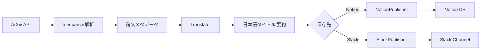

### Medium Daily Digest 処理フロー

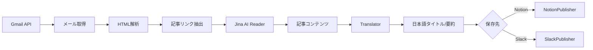

### Medium 全文翻訳フロー

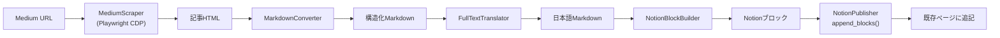

### Google Alerts 記事全文翻訳フロー

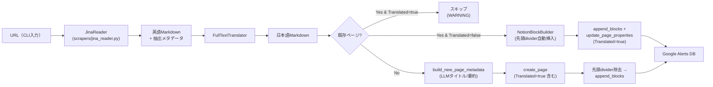

新規ページ作成時は `Translated: True` を properties に含めて `create_page` 1 回で完結させ、追加の `update_page_properties` を発行しない。`MediumCollector` が `r.jina.ai` に対するMedium側のCloudflareブロック対策のため独自実装を維持しているため、`JinaReader` はMedium以外（ニュース・技術ブログ等）専用。

### ArXiv 論文全文翻訳フロー

```mermaid
flowchart LR
    A["ArXiv URL"] --> B["ArxivScraper\n(httpx PDFダウンロード)"]
    B --> C["PDFバイト列"]
    C --> D["marker-pdf\n(PDF→Markdown)"]
    D --> E["raw.md + 画像"]
    E --> F["VlmParseRepairer\n(壊れた表/孤立図の修復)"]
    F --> G["repaired.md\n(修復が適用された場合)"]
    G --> H["FullTextTranslator\n(チャンク翻訳)"]
    H --> I["translated.md\n(日本語訳)"]
    I --> J["NotionBlockBuilder\n(Markdown→ブロック)"]
    J --> K["NotionPublisher\n(File Upload + ページ作成)"]
    K --> L["Notion Database"]
```

3 ステップに分離されており、各ステップは個別に再実行できる:
1. **parse** — PDFダウンロード→marker-pdfでMarkdown化→VLMでパース欠陥を修復
2. **translate** — 見出し単位でチャンク分割し日本語に翻訳
3. **upload** — Notion File Upload APIで画像アップロード→ブロック変換→Notionへ保存

#### VlmParseRepairer の設計判断

`VlmParseRepairer` はパース欠陥の検出と修復を 2 段階に分離している。前段の `ParseErrorDetector` は LLM を使わないヒューリスティック検出器で、壊れた表・孤立した図参照などの候補をローカルで列挙する。これにより、後段の VLM 呼び出しは実際に修復が必要な箇所だけに絞られ、API コストとレイテンシを抑制できる。後段の `VlmRepairer` は `Semaphore=2` で並列度を制限している。これは VLM 呼び出しが画像を含むため 1 リクエストあたりのトークン消費が大きく、プロバイダのレート制限に到達しやすいことと、修復タスク自体が論文 1 本につき数件〜十数件規模であり過度な並列化のメリットが小さいことを踏まえた設定。

### Google Alerts 処理フロー

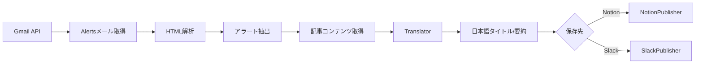

### YouTube 処理フロー

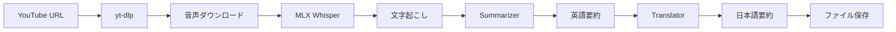

### X トレンド処理フロー（3ソース統合）

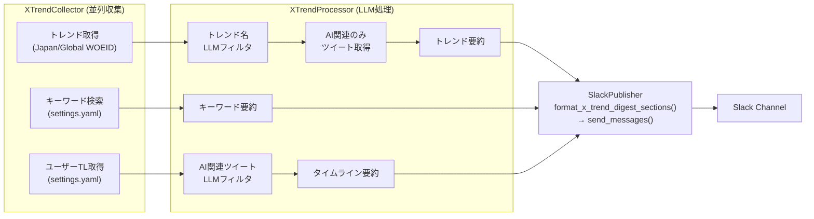

## 外部サービス連携

### LLM抽象化レイヤー

Ollama/OpenAIの両方をサポートするLLM抽象化レイヤー。

| プロバイダー | 用途 | デフォルトモデル | 設定キー |
|-------------|-----|----------------|---------|
| Ollama | 翻訳・要約 | gemma3:27b | `llm.ollama.default_model` |
| OpenAI | 高速処理 | gpt-4o-mini | `llm.openai.default_model` |
| Gemini | 全文翻訳（無料枠活用） | gemini-3.1-flash-lite-preview | `llm.gemini.default_model` |

**Gemini 3 系の `thinking_level` 制御:**

Gemini 3 系で導入された `thinking_level` パラメータ（`minimal` / `low` / `medium` / `high`）を `LangChainGeminiClient` で扱う。Flash / Pro は未指定時のデフォルトが `high` でコスト増を招くため、本実装は未指定時に `minimal` を明示的に渡してコスト想定外発生を防ぐ。

- グローバル既定: `llm.gemini.default_thinking_level`（既定 `minimal`）
- 用途別オーバーライド:
  - `defaults.<機能>.translate_thinking_level`（翻訳系）
  - `defaults.arxiv_translate.vlm_repair.thinking_level`（VLM 修復用、推奨 `medium`）
- 伝搬経路: `get_llm_client(thinking_level=...)` → `LangChainGeminiClient.__init__` → `_get_chat_model().model_kwargs.thinking_config` （JSON モードでも継承）

**連携パターン（LLM抽象化レイヤー経由）:**
```python
from minitools.llm import get_llm_client

# プロバイダーを指定して取得（省略時は設定ファイルから）
client = get_llm_client(provider="ollama")

# 共通インターフェースで呼び出し
response = await client.chat(
    messages=[{"role": "user", "content": prompt}]
)
```

**従来のパターン（直接使用）:**
```python
import ollama

client = ollama.Client()
response = client.chat(
    model="gemma3:27b",
    messages=[{"role": "user", "content": prompt}]
)
```

### Ollama LLM

ローカルで動作するLLMサーバー。翻訳と要約に使用。

| 用途 | モデル | 設定キー |
|-----|--------|---------|
| 翻訳 | gemma3:27b | `models.translation` |
| 要約 | gemma3:27b | `models.summarization` |
| YouTube要約 | gemma3:12b | `models.youtube_summary` |

### Gmail API

Medium Daily DigestとGoogle Alertsメールの取得に使用。

**認証フロー:**
1. OAuth2認証（初回のみブラウザ認証）
2. `token.pickle`にリフレッシュトークン保存
3. 以降は自動更新

**必要なスコープ:**
- `https://www.googleapis.com/auth/gmail.readonly`

**連携パターン:**
```python
from googleapiclient.discovery import build

service = build('gmail', 'v1', credentials=creds)
response = service.users().messages().list(
    userId='me',
    q='from:noreply@medium.com'
).execute()
```

### Notion API

処理結果の保存先データベース。

**機能:**
- ページ作成
- 重複チェック（URL検索）
- バッチ保存

**連携パターン:**
```python
from notion_client import Client

client = Client(auth=api_key)
page = client.pages.create(
    parent={"database_id": database_id},
    properties=properties
)
```

**プロパティマッピング（ソース別）:**

| ソース | Title | URL | Summary | その他 |
|-------|-------|-----|---------|-------|
| ArXiv | タイトル | URL | 日本語訳 | 公開日, 概要 |
| Medium | Title | URL | Summary | Japanese Title, Author, Date, Claps (Number), Translated (Checkbox) |
| Google Alerts | Title (日本語) | URL | Summary | Original Title, Source, Tags |

### Slack Webhook

処理完了通知の送信先。

**連携パターン:**
```python
import aiohttp

async with aiohttp.ClientSession() as session:
    async with session.post(webhook_url, json={"text": message}) as response:
        return response.status == 200
```

### Jina AI Reader

Medium記事のコンテンツ取得に使用。

**エンドポイント:** `https://r.jina.ai/{url}`

**特徴:**
- HTMLをMarkdown形式で返却
- Cloudflareによるブロックあり
- User-Agentローテーションで回避

### Tavily API

ArXiv週次ダイジェストでのトレンド調査に使用。

**機能:**
- AI/機械学習分野の最新トレンド検索
- 検索結果のサマリー生成（`include_answer=True`）
- トピック抽出

**連携パターン:**
```python
from tavily import TavilyClient

client = TavilyClient(api_key=api_key)
response = client.search(
    query="AI machine learning latest trends",
    search_depth="basic",
    max_results=5,
    include_answer=True,
)
# response: {answer, results: [{title, url, content}, ...]}
```

**必要な環境変数:**
- `TAVILY_API_KEY`: Tavily APIキー（オプション、未設定時はトレンド調査をスキップ）

### TwitterAPI.io

X (Twitter) のトレンド取得、ツイート検索、ユーザータイムライン取得に使用。

**エンドポイント:**
- `GET /twitter/trends` — トレンド取得（WOEID指定）
- `GET /twitter/tweet/advanced_search` — ツイート検索（トレンド名/キーワード）
- `GET /twitter/user/last_tweets` — ユーザータイムライン取得

**連携パターン:**
```python
async with XTrendCollector() as collector:
    result = await collector.collect_all(
        regions=["japan", "global"],
        keywords=["Claude Code", "AI Agent"],
        watch_accounts=["kaboratory"],
    )
```

**必要な環境変数:**
- `TWITTER_API_IO_KEY`: TwitterAPI.io APIキー
- `SLACK_X_TIMELINE_SUMMARY_WEBHOOK_URL`: X トレンドダイジェスト用Slack Webhook URL

## 設定システム概要

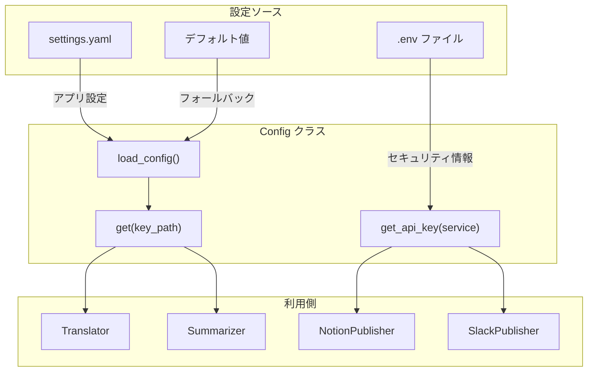

### 設定の優先順位

1. **環境変数** (最高優先)
2. **settings.yaml**
3. **デフォルト値** (最低優先)

### 設定ファイルの役割分担

| ファイル | 内容 | 例 |
|---------|------|---|
| `.env` | セキュリティ情報 | APIキー、Webhook URL |
| `settings.yaml` | アプリ設定 | モデル名、並列数、デフォルト値 |

## 非同期処理アーキテクチャ

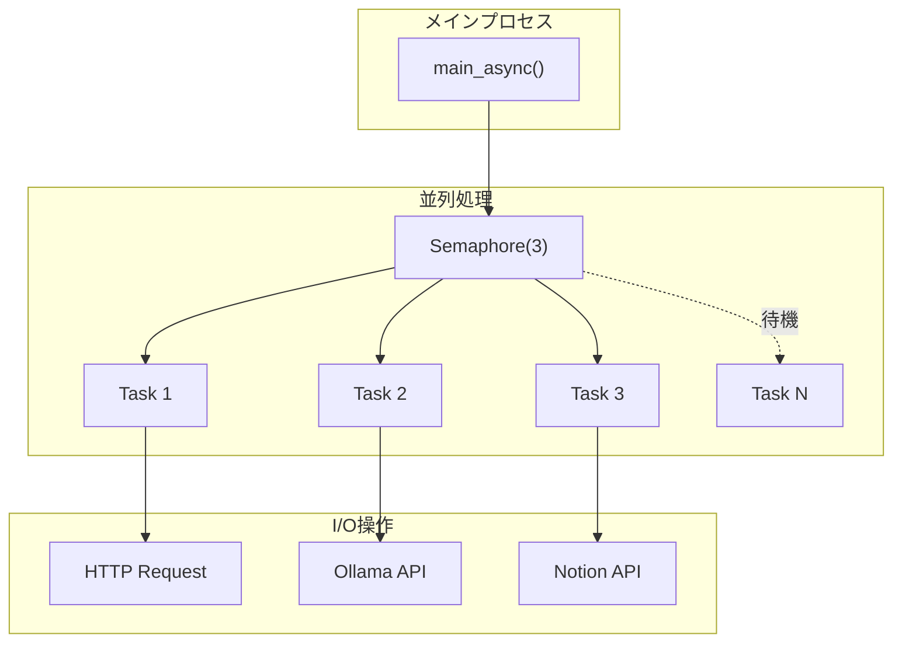

### 並列制限の設定

| 項目 | デフォルト値 | 設定キー |
|-----|------------|---------|
| 記事処理 | 10 | `processing.max_concurrent_articles` |
| Ollama API | 3 | `processing.max_concurrent_ollama` |
| Notion API | 3 | `processing.max_concurrent_notion` |
| HTTP接続 | 10 | `processing.max_concurrent_http` |

### バッチスコアリング

週次ダイジェスト（`WeeklyDigestProcessor`, `ArxivWeeklyProcessor`）では、バッチ処理により複数記事/論文を1回のLLM呼び出しでスコアリングします。

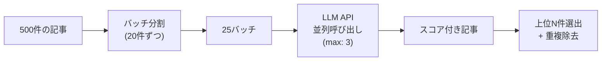

| 設定項目 | デフォルト値 | 設定キー |
|---------|------------|---------|
| バッチサイズ（週次ダイジェスト） | 20 | `defaults.weekly_digest.batch_size` |
| バッチサイズ（ArXiv週次） | 20 | `defaults.arxiv_weekly.batch_size` |
| デフォルトプロバイダー（週次ダイジェスト） | openai | `defaults.weekly_digest.provider` |
| デフォルトプロバイダー（ArXiv週次） | openai | `defaults.arxiv_weekly.provider` |

**エラーハンドリング:**
- バッチ処理が失敗した場合、自動的に個別処理にフォールバック
- 個別処理も失敗した場合、デフォルトスコア（5.0）を付与
- 部分的な失敗でも処理は継続

## デプロイメントアーキテクチャ

### ローカル実行

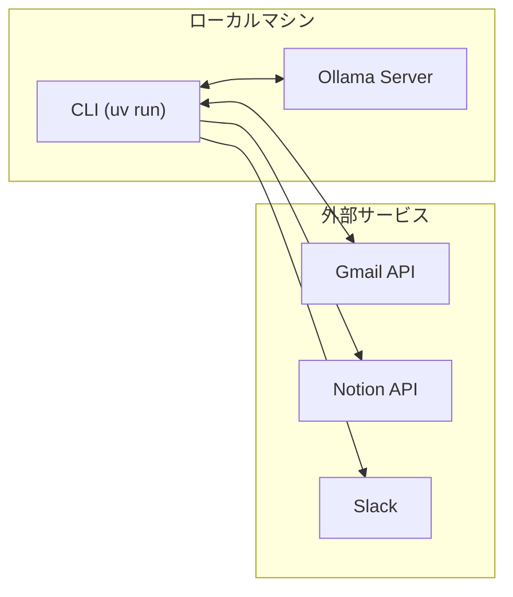

### Docker実行

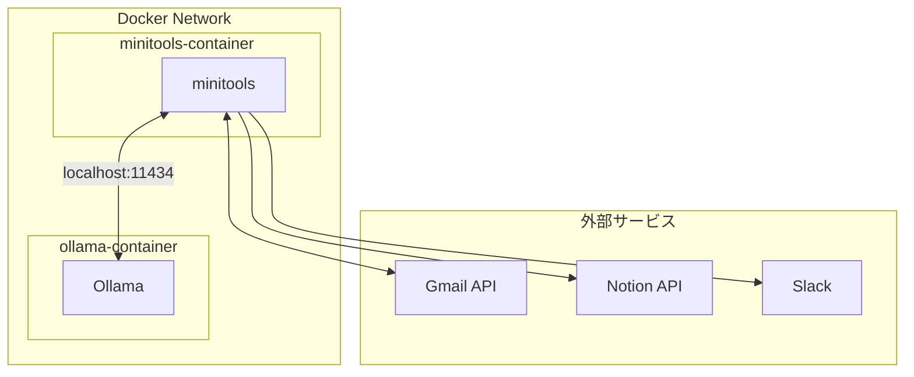

## エラー回復戦略

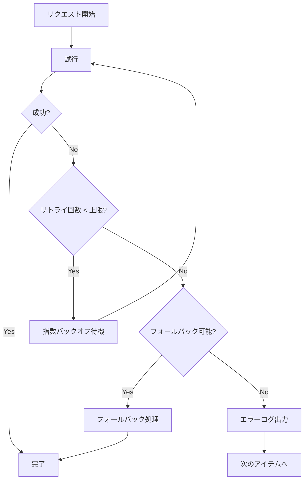

### フォールバック戦略

| シナリオ | フォールバック |
|---------|--------------|
| Jina Reader ブロック | メールのプレビューテキストを使用 |
| 記事コンテンツ取得失敗 | スニペットを使用 |
| 翻訳エラー | 元のテキストを返却 |
| mlx-whisper 未インストール | エラーメッセージを表示して終了 |
