# Mermaid図

このドキュメントは、minitoolsプロジェクトの処理フローとクラス関係をMermaid図で説明します。

## ツール別シーケンス図

### ArXiv 処理フロー

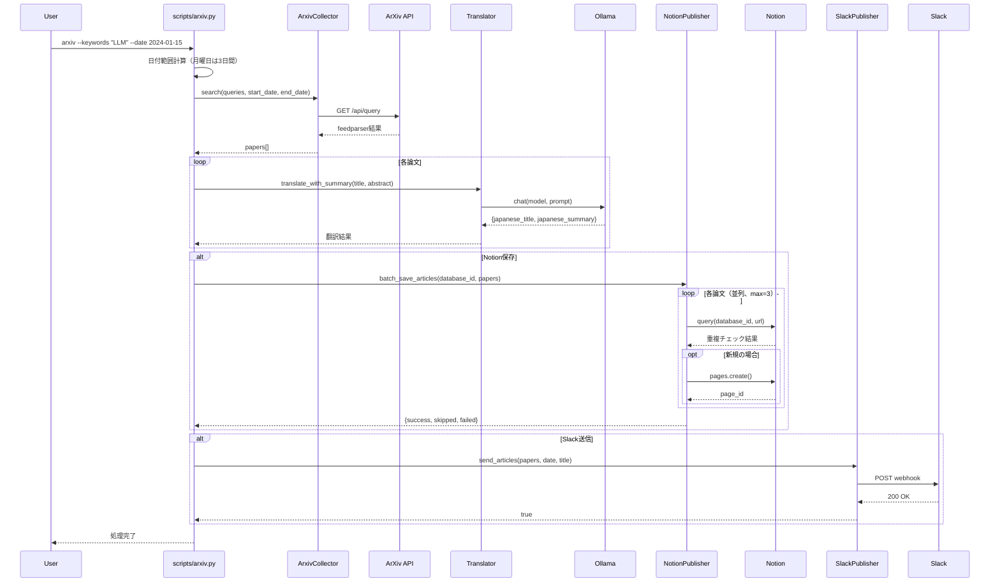
```mermaid
sequenceDiagram
    participant User
    participant CLI as scripts/arxiv.py
    participant AC as ArxivCollector
    participant ArXiv as ArXiv API
    participant TR as Translator
    participant Ollama
    participant NP as NotionPublisher
    participant Notion
    participant SP as SlackPublisher
    participant Slack

    User->>CLI: arxiv --keywords "LLM" --date 2024-01-15
    CLI->>CLI: 日付範囲計算（月曜日は3日間）

    CLI->>AC: search(queries, start_date, end_date)
    AC->>ArXiv: GET /api/query
    ArXiv-->>AC: feedparser結果
    AC-->>CLI: papers[]

    loop 各論文
        CLI->>TR: translate_with_summary(title, abstract)
        TR->>Ollama: chat(model, prompt)
        Ollama-->>TR: {japanese_title, japanese_summary}
        TR-->>CLI: 翻訳結果
    end

    alt Notion保存
        CLI->>NP: batch_save_articles(database_id, papers)
        loop 各論文（並列、max=3）
            NP->>Notion: query(database_id, url)
            Notion-->>NP: 重複チェック結果
            opt 新規の場合
                NP->>Notion: pages.create()
                Notion-->>NP: page_id
            end
        end
        NP-->>CLI: {success, skipped, failed}
    end

    alt Slack送信
        CLI->>SP: send_articles(papers, date, title)
        SP->>Slack: POST webhook
        Slack-->>SP: 200 OK
        SP-->>CLI: true
    end

    CLI-->>User: 処理完了
```

### Medium Daily Digest 処理フロー

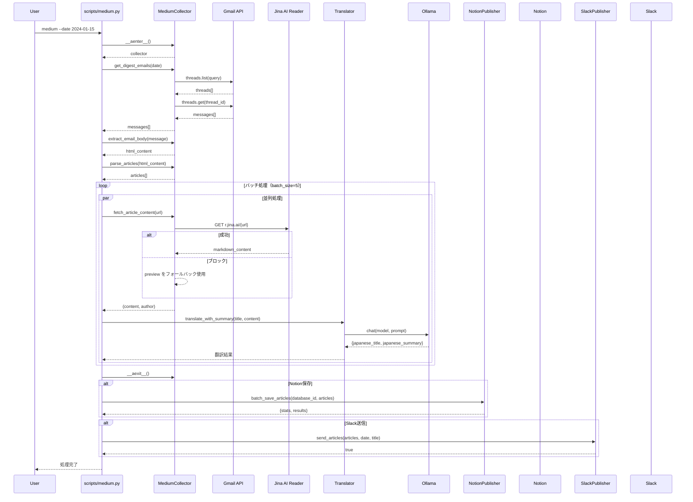
```mermaid
sequenceDiagram
    participant User
    participant CLI as scripts/medium.py
    participant MC as MediumCollector
    participant Gmail as Gmail API
    participant Jina as Jina AI Reader
    participant TR as Translator
    participant Ollama
    participant NP as NotionPublisher
    participant Notion
    participant SP as SlackPublisher
    participant Slack

    User->>CLI: medium --date 2024-01-15
    CLI->>MC: __aenter__()
    MC-->>CLI: collector

    CLI->>MC: get_digest_emails(date)
    MC->>Gmail: threads.list(query)
    Gmail-->>MC: threads[]
    MC->>Gmail: threads.get(thread_id)
    Gmail-->>MC: messages[]
    MC-->>CLI: messages[]

    CLI->>MC: extract_email_body(message)
    MC-->>CLI: html_content

    CLI->>MC: parse_articles(html_content)
    MC-->>CLI: articles[]

    loop バッチ処理（batch_size=5）
        par 並列処理
            CLI->>MC: fetch_article_content(url)
            MC->>Jina: GET r.jina.ai/{url}
            alt 成功
                Jina-->>MC: markdown_content
            else ブロック
                MC-->>MC: preview をフォールバック使用
            end
            MC-->>CLI: (content, author)

            CLI->>TR: translate_with_summary(title, content)
            TR->>Ollama: chat(model, prompt)
            Ollama-->>TR: {japanese_title, japanese_summary}
            TR-->>CLI: 翻訳結果
        end
    end

    CLI->>MC: __aexit__()

    alt Notion保存
        CLI->>NP: batch_save_articles(database_id, articles)
        NP-->>CLI: {stats, results}
    end

    alt Slack送信
        CLI->>SP: send_articles(articles, date, title)
        SP-->>CLI: true
    end

    CLI-->>User: 処理完了
```

### Medium 全文翻訳フロー

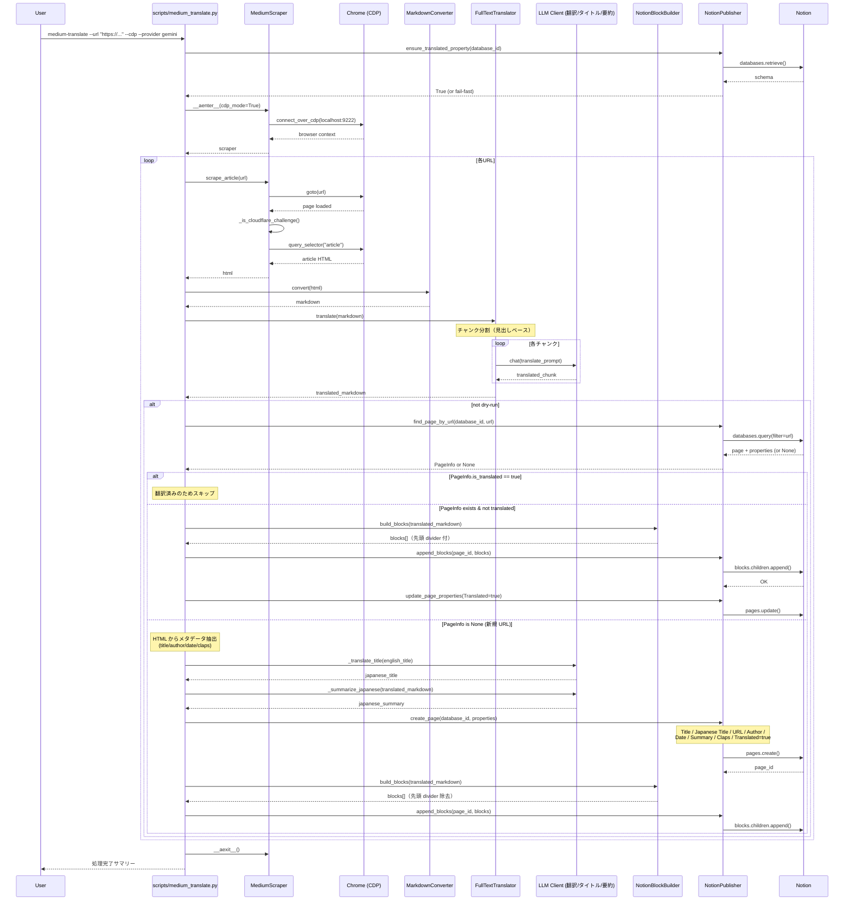
```mermaid
sequenceDiagram
    participant User
    participant CLI as scripts/medium_translate.py
    participant MS as MediumScraper
    participant Chrome as Chrome (CDP)
    participant MDC as MarkdownConverter
    participant FTT as FullTextTranslator
    participant LLM as LLM Client (翻訳/タイトル/要約)
    participant NBB as NotionBlockBuilder
    participant NP as NotionPublisher
    participant Notion

    User->>CLI: medium-translate --url "https://..." --cdp --provider gemini
    CLI->>NP: ensure_translated_property(database_id)
    NP->>Notion: databases.retrieve()
    Notion-->>NP: schema
    NP-->>CLI: True (or fail-fast)

    CLI->>MS: __aenter__(cdp_mode=True)
    MS->>Chrome: connect_over_cdp(localhost:9222)
    Chrome-->>MS: browser context
    MS-->>CLI: scraper

    loop 各URL
        CLI->>MS: scrape_article(url)
        MS->>Chrome: goto(url)
        Chrome-->>MS: page loaded
        MS->>MS: _is_cloudflare_challenge()
        MS->>Chrome: query_selector("article")
        Chrome-->>MS: article HTML
        MS-->>CLI: html

        CLI->>MDC: convert(html)
        MDC-->>CLI: markdown

        CLI->>FTT: translate(markdown)
        Note over FTT: チャンク分割（見出しベース）
        loop 各チャンク
            FTT->>LLM: chat(translate_prompt)
            LLM-->>FTT: translated_chunk
        end
        FTT-->>CLI: translated_markdown

        alt not dry-run
            CLI->>NP: find_page_by_url(database_id, url)
            NP->>Notion: databases.query(filter=url)
            Notion-->>NP: page + properties (or None)
            NP-->>CLI: PageInfo or None

            alt PageInfo.is_translated == true
                Note over CLI: 翻訳済みのためスキップ
            else PageInfo exists & not translated
                CLI->>NBB: build_blocks(translated_markdown)
                NBB-->>CLI: blocks[]（先頭 divider 付）
                CLI->>NP: append_blocks(page_id, blocks)
                NP->>Notion: blocks.children.append()
                Notion-->>NP: OK
                CLI->>NP: update_page_properties(Translated=true)
                NP->>Notion: pages.update()
            else PageInfo is None (新規 URL)
                Note over CLI: HTML からメタデータ抽出<br/>(title/author/date/claps)
                CLI->>LLM: _translate_title(english_title)
                LLM-->>CLI: japanese_title
                CLI->>LLM: _summarize_japanese(translated_markdown)
                LLM-->>CLI: japanese_summary
                CLI->>NP: create_page(database_id, properties)
                Note over NP: Title / Japanese Title / URL / Author /<br/>Date / Summary / Claps / Translated=true
                NP->>Notion: pages.create()
                Notion-->>NP: page_id
                CLI->>NBB: build_blocks(translated_markdown)
                NBB-->>CLI: blocks[]（先頭 divider 除去）
                CLI->>NP: append_blocks(page_id, blocks)
                NP->>Notion: blocks.children.append()
            end
        end
    end

    CLI->>MS: __aexit__()
    CLI-->>User: 処理完了サマリー
```

### ArXiv 論文全文翻訳フロー

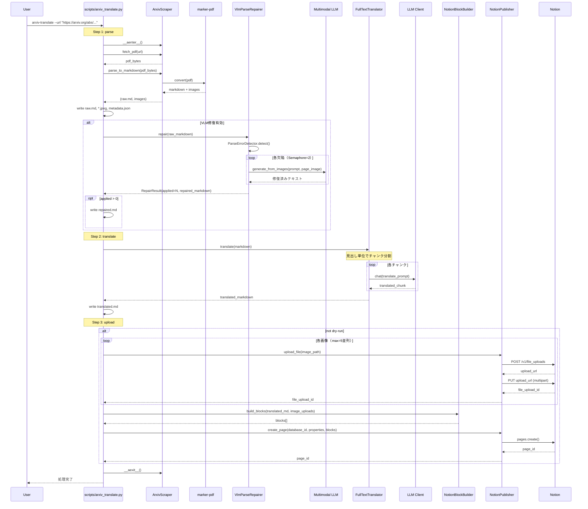
```mermaid
sequenceDiagram
    participant User
    participant CLI as scripts/arxiv_translate.py
    participant AS as ArxivScraper
    participant Marker as marker-pdf
    participant VPR as VlmParseRepairer
    participant VLM as Multimodal LLM
    participant FTT as FullTextTranslator
    participant LLM as LLM Client
    participant NBB as NotionBlockBuilder
    participant NP as NotionPublisher
    participant Notion

    User->>CLI: arxiv-translate --url "https://arxiv.org/abs/..."

    Note over CLI: Step 1: parse
    CLI->>AS: __aenter__()
    CLI->>AS: fetch_pdf(url)
    AS-->>CLI: pdf_bytes
    CLI->>AS: parse_to_markdown(pdf_bytes)
    AS->>Marker: convert(pdf)
    Marker-->>AS: markdown + images
    AS-->>CLI: (raw.md, images)
    CLI->>CLI: write raw.md, *.jpeg, metadata.json

    alt VLM修復有効
        CLI->>VPR: repair(raw_markdown)
        VPR->>VPR: ParseErrorDetector.detect()
        loop 各欠陥（Semaphore=2）
            VPR->>VLM: generate_from_images(prompt, page_image)
            VLM-->>VPR: 修復済みテキスト
        end
        VPR-->>CLI: RepairResult(applied=N, repaired_markdown)
        opt applied > 0
            CLI->>CLI: write repaired.md
        end
    end

    Note over CLI: Step 2: translate
    CLI->>FTT: translate(markdown)
    Note over FTT: 見出し単位でチャンク分割
    loop 各チャンク
        FTT->>LLM: chat(translate_prompt)
        LLM-->>FTT: translated_chunk
    end
    FTT-->>CLI: translated_markdown
    CLI->>CLI: write translated.md

    Note over CLI: Step 3: upload
    alt not dry-run
        loop 各画像（max=5並列）
            CLI->>NP: upload_file(image_path)
            NP->>Notion: POST /v1/file_uploads
            Notion-->>NP: upload_url
            NP->>Notion: PUT upload_url (multipart)
            Notion-->>NP: file_upload_id
            NP-->>CLI: file_upload_id
        end
        CLI->>NBB: build_blocks(translated_md, image_uploads)
        NBB-->>CLI: blocks[]
        CLI->>NP: create_page(database_id, properties, blocks)
        NP->>Notion: pages.create()
        Notion-->>NP: page_id
        NP-->>CLI: page_id
    end

    CLI->>AS: __aexit__()
    CLI-->>User: 処理完了
```

#### 出力ディレクトリ構造

`arxiv-translate` は論文ごとに `outputs/arxiv_translate/{safe_id}/` フォルダを作成する。`safe_id` は arXiv ID (例: `2401.12345`) のドットをアンダースコアに置換したもの。

```
outputs/arxiv_translate/{safe_id}/
├── {safe_id}.pdf           # PDF（識別性のため safe_id 維持）
├── metadata.json           # PaperMetadata（arxiv_id, title, authors, published, abstract）
├── raw.md                  # marker-pdf 出力（VLM 修復前）
├── repaired.md             # VLM 修復後（applied > 0 のときのみ生成）
├── translated.md           # 日本語訳（最終出力）
├── _page_X_Figure_Y.jpeg   # PDF から抽出した画像（裸ファイル名で配置）
├── _page_X_Picture_Y.jpeg  # marker-pdf の image refs と一致
└── page_images/            # VLM 修復用ページレンダリングキャッシュ（PNG）
```

各ステップが書き込むファイル:
- `parse`: `{safe_id}.pdf`, `metadata.json`, `raw.md`, `_page_*.jpeg`, `page_images/`, `repaired.md`
- `translate`: `translated.md`
- `upload`: 既存ファイルを参照のみ（書き込みなし）

### Google Alerts 処理フロー

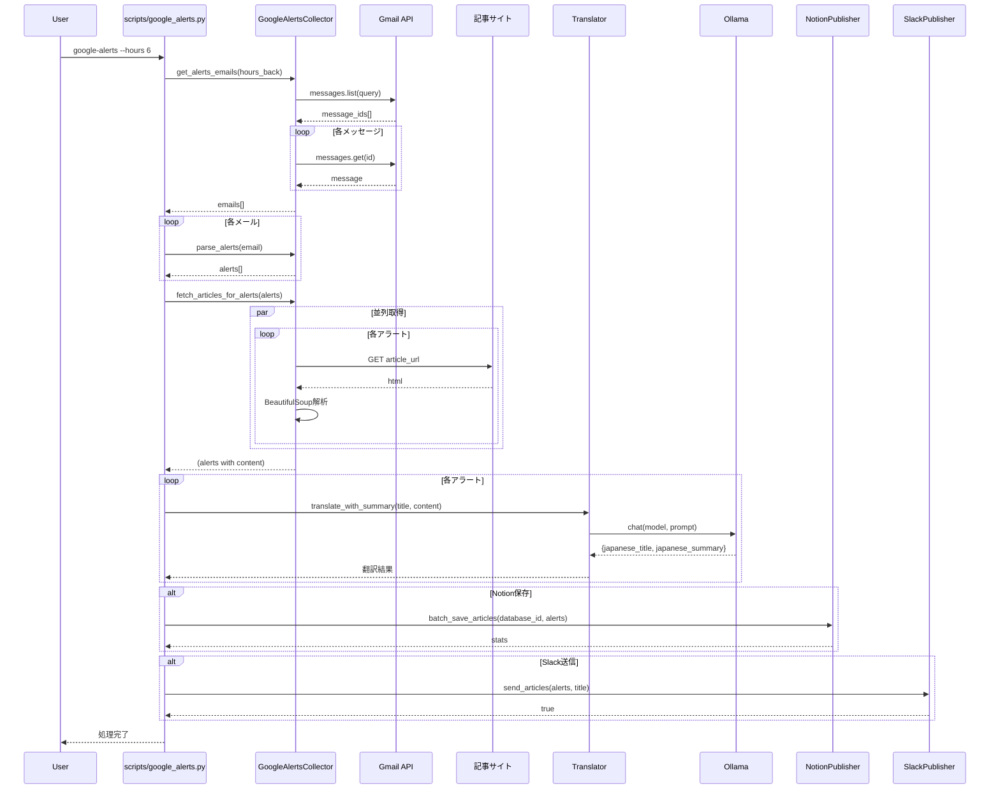
```mermaid
sequenceDiagram
    participant User
    participant CLI as scripts/google_alerts.py
    participant GAC as GoogleAlertsCollector
    participant Gmail as Gmail API
    participant Web as 記事サイト
    participant TR as Translator
    participant Ollama
    participant NP as NotionPublisher
    participant SP as SlackPublisher

    User->>CLI: google-alerts --hours 6
    CLI->>GAC: get_alerts_emails(hours_back)
    GAC->>Gmail: messages.list(query)
    Gmail-->>GAC: message_ids[]

    loop 各メッセージ
        GAC->>Gmail: messages.get(id)
        Gmail-->>GAC: message
    end
    GAC-->>CLI: emails[]

    loop 各メール
        CLI->>GAC: parse_alerts(email)
        GAC-->>CLI: alerts[]
    end

    CLI->>GAC: fetch_articles_for_alerts(alerts)
    par 並列取得
        loop 各アラート
            GAC->>Web: GET article_url
            Web-->>GAC: html
            GAC->>GAC: BeautifulSoup解析
        end
    end
    GAC-->>CLI: (alerts with content)

    loop 各アラート
        CLI->>TR: translate_with_summary(title, content)
        TR->>Ollama: chat(model, prompt)
        Ollama-->>TR: {japanese_title, japanese_summary}
        TR-->>CLI: 翻訳結果
    end

    alt Notion保存
        CLI->>NP: batch_save_articles(database_id, alerts)
        NP-->>CLI: stats
    end

    alt Slack送信
        CLI->>SP: send_articles(alerts, title)
        SP-->>CLI: true
    end

    CLI-->>User: 処理完了
```

### YouTube 処理フロー

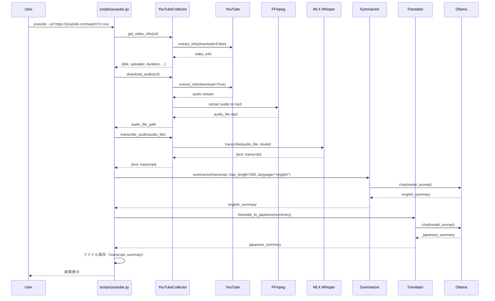
```mermaid
sequenceDiagram
    participant User
    participant CLI as scripts/youtube.py
    participant YC as YouTubeCollector
    participant YT as YouTube
    participant FFmpeg
    participant Whisper as MLX Whisper
    participant SU as Summarizer
    participant TR as Translator
    participant Ollama

    User->>CLI: youtube --url https://youtube.com/watch?v=xxx

    CLI->>YC: get_video_info(url)
    YC->>YT: extract_info(download=False)
    YT-->>YC: video_info
    YC-->>CLI: {title, uploader, duration, ...}

    CLI->>YC: download_audio(url)
    YC->>YT: extract_info(download=True)
    YT-->>YC: audio stream
    YC->>FFmpeg: extract audio to mp3
    FFmpeg-->>YC: audio_file.mp3
    YC-->>CLI: audio_file_path

    CLI->>YC: transcribe_audio(audio_file)
    YC->>Whisper: transcribe(audio_file, model)
    Whisper-->>YC: {text: transcript}
    YC-->>CLI: {text: transcript}

    CLI->>SU: summarize(transcript, max_length=500, language="english")
    SU->>Ollama: chat(model, prompt)
    Ollama-->>SU: english_summary
    SU-->>CLI: english_summary

    CLI->>TR: translate_to_japanese(summary)
    TR->>Ollama: chat(model, prompt)
    Ollama-->>TR: japanese_summary
    TR-->>CLI: japanese_summary

    CLI->>CLI: ファイル保存（transcript, summary）

    CLI-->>User: 結果表示
```

### Google Alert Weekly Digest 処理フロー

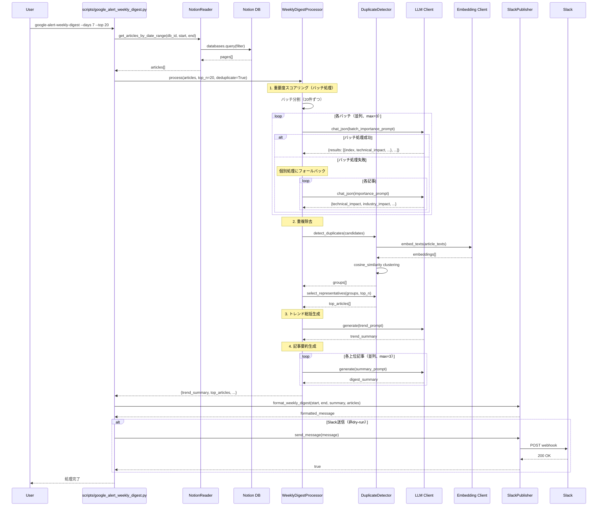
```mermaid
sequenceDiagram
    participant User
    participant CLI as scripts/google_alert_weekly_digest.py
    participant NR as NotionReader
    participant Notion as Notion DB
    participant WDP as WeeklyDigestProcessor
    participant DD as DuplicateDetector
    participant LLM as LLM Client
    participant Embed as Embedding Client
    participant SP as SlackPublisher
    participant Slack

    User->>CLI: google-alert-weekly-digest --days 7 --top 20

    CLI->>NR: get_articles_by_date_range(db_id, start, end)
    NR->>Notion: databases.query(filter)
    Notion-->>NR: pages[]
    NR-->>CLI: articles[]

    CLI->>WDP: process(articles, top_n=20, deduplicate=True)

    Note over WDP: 1. 重要度スコアリング（バッチ処理）
    WDP->>WDP: バッチ分割（20件ずつ）
    loop 各バッチ（並列、max=3）
        WDP->>LLM: chat_json(batch_importance_prompt)
        alt バッチ処理成功
            LLM-->>WDP: {results: [{index, technical_impact, ...}, ...]}
        else バッチ処理失敗
            Note over WDP: 個別処理にフォールバック
            loop 各記事
                WDP->>LLM: chat_json(importance_prompt)
                LLM-->>WDP: {technical_impact, industry_impact, ...}
            end
        end
    end

    Note over WDP: 2. 重複除去
    WDP->>DD: detect_duplicates(candidates)
    DD->>Embed: embed_texts(article_texts)
    Embed-->>DD: embeddings[]
    DD->>DD: cosine_similarity clustering
    DD-->>WDP: groups[]
    WDP->>DD: select_representatives(groups, top_n)
    DD-->>WDP: top_articles[]

    Note over WDP: 3. トレンド総括生成
    WDP->>LLM: generate(trend_prompt)
    LLM-->>WDP: trend_summary

    Note over WDP: 4. 記事要約生成
    loop 各上位記事（並列、max=3）
        WDP->>LLM: generate(summary_prompt)
        LLM-->>WDP: digest_summary
    end

    WDP-->>CLI: {trend_summary, top_articles, ...}

    CLI->>SP: format_weekly_digest(start, end, summary, articles)
    SP-->>CLI: formatted_message

    alt Slack送信（非dry-run）
        CLI->>SP: send_message(message)
        SP->>Slack: POST webhook
        Slack-->>SP: 200 OK
        SP-->>CLI: true
    end

    CLI-->>User: 処理完了
```

### ArXiv Weekly Digest 処理フロー（2層構成）

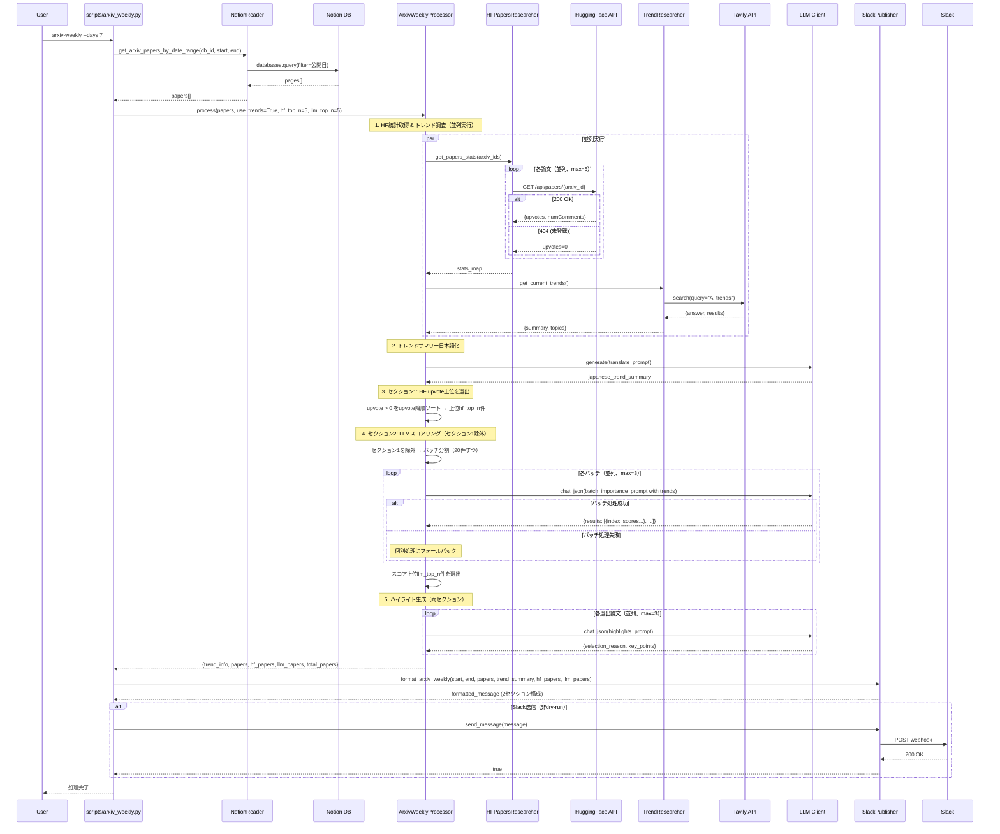
```mermaid
sequenceDiagram
    participant User
    participant CLI as scripts/arxiv_weekly.py
    participant NR as NotionReader
    participant Notion as Notion DB
    participant AWP as ArxivWeeklyProcessor
    participant HFR as HFPapersResearcher
    participant HF as HuggingFace API
    participant TrendR as TrendResearcher
    participant Tavily as Tavily API
    participant LLM as LLM Client
    participant SP as SlackPublisher
    participant Slack

    User->>CLI: arxiv-weekly --days 7

    CLI->>NR: get_arxiv_papers_by_date_range(db_id, start, end)
    NR->>Notion: databases.query(filter=公開日)
    Notion-->>NR: pages[]
    NR-->>CLI: papers[]

    CLI->>AWP: process(papers, use_trends=True, hf_top_n=5, llm_top_n=5)

    Note over AWP: 1. HF統計取得 & トレンド調査（並列実行）
    par 並列実行
        AWP->>HFR: get_papers_stats(arxiv_ids)
        loop 各論文（並列、max=5）
            HFR->>HF: GET /api/papers/{arxiv_id}
            alt 200 OK
                HF-->>HFR: {upvotes, numComments}
            else 404 (未登録)
                HF-->>HFR: upvotes=0
            end
        end
        HFR-->>AWP: stats_map

        AWP->>TrendR: get_current_trends()
        TrendR->>Tavily: search(query="AI trends")
        Tavily-->>TrendR: {answer, results}
        TrendR-->>AWP: {summary, topics}
    end

    Note over AWP: 2. トレンドサマリー日本語化
    AWP->>LLM: generate(translate_prompt)
    LLM-->>AWP: japanese_trend_summary

    Note over AWP: 3. セクション1: HF upvote上位を選出
    AWP->>AWP: upvote > 0 をupvote降順ソート → 上位hf_top_n件

    Note over AWP: 4. セクション2: LLMスコアリング（セクション1除外）
    AWP->>AWP: セクション1を除外 → バッチ分割（20件ずつ）
    loop 各バッチ（並列、max=3）
        AWP->>LLM: chat_json(batch_importance_prompt with trends)
        alt バッチ処理成功
            LLM-->>AWP: {results: [{index, scores...}, ...]}
        else バッチ処理失敗
            Note over AWP: 個別処理にフォールバック
        end
    end
    AWP->>AWP: スコア上位llm_top_n件を選出

    Note over AWP: 5. ハイライト生成（両セクション）
    loop 各選出論文（並列、max=3）
        AWP->>LLM: chat_json(highlights_prompt)
        LLM-->>AWP: {selection_reason, key_points}
    end

    AWP-->>CLI: {trend_info, papers, hf_papers, llm_papers, total_papers}

    CLI->>SP: format_arxiv_weekly(start, end, papers, trend_summary, hf_papers, llm_papers)
    SP-->>CLI: formatted_message (2セクション構成)

    alt Slack送信（非dry-run）
        CLI->>SP: send_message(message)
        SP->>Slack: POST webhook
        Slack-->>SP: 200 OK
        SP-->>CLI: true
    end

    CLI-->>User: 処理完了
```

### Google Alerts 全文翻訳フロー

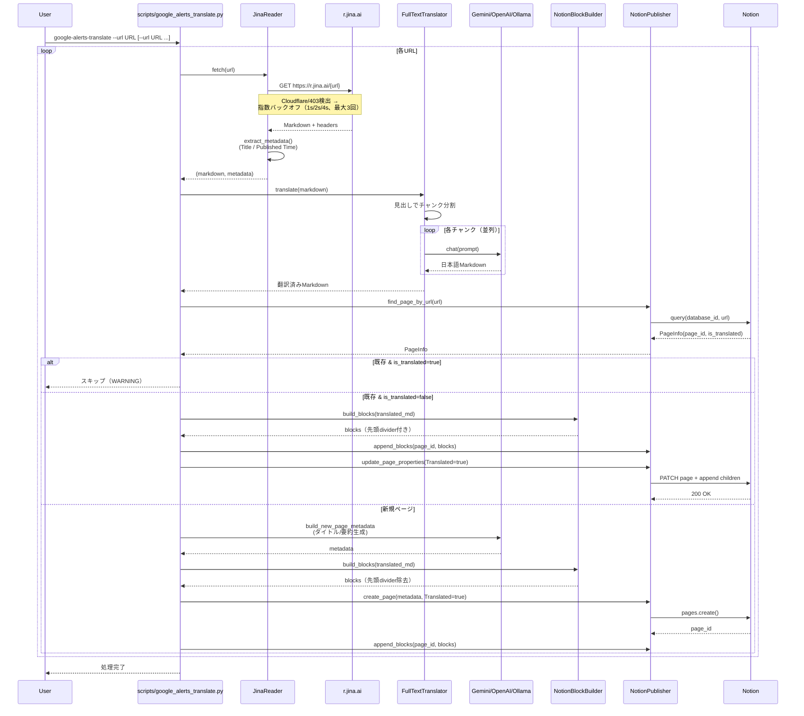
```mermaid
sequenceDiagram
    participant User
    participant CLI as scripts/google_alerts_translate.py
    participant JR as JinaReader
    participant Jina as r.jina.ai
    participant FTT as FullTextTranslator
    participant LLM as Gemini/OpenAI/Ollama
    participant NBB as NotionBlockBuilder
    participant NP as NotionPublisher
    participant Notion

    User->>CLI: google-alerts-translate --url URL [--url URL ...]

    loop 各URL
        CLI->>JR: fetch(url)
        JR->>Jina: GET https://r.jina.ai/{url}
        Note over JR,Jina: Cloudflare/403検出 →<br/>指数バックオフ（1s/2s/4s、最大3回）
        Jina-->>JR: Markdown + headers
        JR->>JR: extract_metadata()<br/>(Title / Published Time)
        JR-->>CLI: (markdown, metadata)

        CLI->>FTT: translate(markdown)
        FTT->>FTT: 見出しでチャンク分割
        loop 各チャンク（並列）
            FTT->>LLM: chat(prompt)
            LLM-->>FTT: 日本語Markdown
        end
        FTT-->>CLI: 翻訳済みMarkdown

        CLI->>NP: find_page_by_url(url)
        NP->>Notion: query(database_id, url)
        Notion-->>NP: PageInfo(page_id, is_translated)
        NP-->>CLI: PageInfo

        alt 既存 & is_translated=true
            CLI-->>User: スキップ（WARNING）
        else 既存 & is_translated=false
            CLI->>NBB: build_blocks(translated_md)
            NBB-->>CLI: blocks（先頭divider付き）
            CLI->>NP: append_blocks(page_id, blocks)
            CLI->>NP: update_page_properties(Translated=true)
            NP->>Notion: PATCH page + append children
            Notion-->>NP: 200 OK
        else 新規ページ
            CLI->>LLM: build_new_page_metadata<br/>(タイトル/要約生成)
            LLM-->>CLI: metadata
            CLI->>NBB: build_blocks(translated_md)
            NBB-->>CLI: blocks（先頭divider除去）
            CLI->>NP: create_page(metadata, Translated=true)
            NP->>Notion: pages.create()
            Notion-->>NP: page_id
            CLI->>NP: append_blocks(page_id, blocks)
        end
    end

    CLI-->>User: 処理完了
```

### X トレンド処理フロー（3ソース統合）

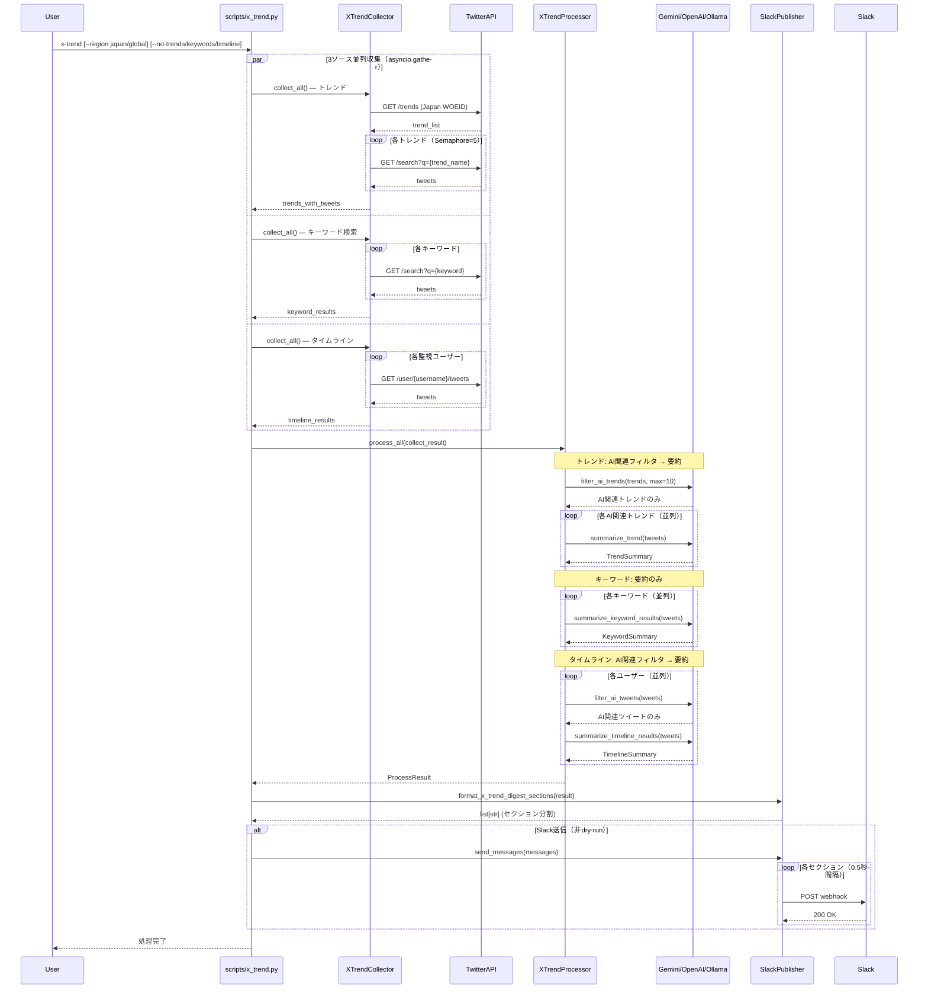
```mermaid
sequenceDiagram
    participant User
    participant CLI as scripts/x_trend.py
    participant XTC as XTrendCollector
    participant TwitterAPI
    participant XTP as XTrendProcessor
    participant LLM as Gemini/OpenAI/Ollama
    participant SP as SlackPublisher
    participant Slack

    User->>CLI: x-trend [--region japan/global] [--no-trends/keywords/timeline]

    par 3ソース並列収集（asyncio.gather）
        CLI->>XTC: collect_all() — トレンド
        XTC->>TwitterAPI: GET /trends (Japan WOEID)
        TwitterAPI-->>XTC: trend_list
        loop 各トレンド（Semaphore=5）
            XTC->>TwitterAPI: GET /search?q={trend_name}
            TwitterAPI-->>XTC: tweets
        end
        XTC-->>CLI: trends_with_tweets
    and
        CLI->>XTC: collect_all() — キーワード検索
        loop 各キーワード
            XTC->>TwitterAPI: GET /search?q={keyword}
            TwitterAPI-->>XTC: tweets
        end
        XTC-->>CLI: keyword_results
    and
        CLI->>XTC: collect_all() — タイムライン
        loop 各監視ユーザー
            XTC->>TwitterAPI: GET /user/{username}/tweets
            TwitterAPI-->>XTC: tweets
        end
        XTC-->>CLI: timeline_results
    end

    CLI->>XTP: process_all(collect_result)

    Note over XTP,LLM: トレンド: AI関連フィルタ → 要約
    XTP->>LLM: filter_ai_trends(trends, max=10)
    LLM-->>XTP: AI関連トレンドのみ
    loop 各AI関連トレンド（並列）
        XTP->>LLM: summarize_trend(tweets)
        LLM-->>XTP: TrendSummary
    end

    Note over XTP,LLM: キーワード: 要約のみ
    loop 各キーワード（並列）
        XTP->>LLM: summarize_keyword_results(tweets)
        LLM-->>XTP: KeywordSummary
    end

    Note over XTP,LLM: タイムライン: AI関連フィルタ → 要約
    loop 各ユーザー（並列）
        XTP->>LLM: filter_ai_tweets(tweets)
        LLM-->>XTP: AI関連ツイートのみ
        XTP->>LLM: summarize_timeline_results(tweets)
        LLM-->>XTP: TimelineSummary
    end

    XTP-->>CLI: ProcessResult

    CLI->>SP: format_x_trend_digest_sections(result)
    SP-->>CLI: list[str] (セクション分割)

    alt Slack送信（非dry-run）
        CLI->>SP: send_messages(messages)
        loop 各セクション（0.5秒間隔）
            SP->>Slack: POST webhook
            Slack-->>SP: 200 OK
        end
    end

    CLI-->>User: 処理完了
```

## クラス関係図


```mermaid
classDiagram
    class ArxivCollector {
        +str base_url
        +ClientSession http_session
        +__aenter__()
        +__aexit__()
        +search(queries, start_date, end_date, max_results)
        +fetch_paper_details_async(paper_url)
    }

    class MediumCollector {
        +Service gmail_service
        +ClientSession http_session
        +str credentials_path
        +__aenter__()
        +__aexit__()
        +get_digest_emails(date)
        +parse_articles(html_content)
        +fetch_article_content(url, max_retries)
        +extract_email_body(message)
        -_authenticate_gmail()
        -_clean_url(url)
        -_extract_author_from_jina(content)
    }

    class GoogleAlertsCollector {
        +Service gmail_service
        +str credentials_path
        +get_alerts_emails(hours_back, date)
        +parse_alerts(message)
        +fetch_article_content(url, retry_count)
        +fetch_articles_for_alerts(alerts)
        -_authenticate_gmail()
        -_extract_body(message)
    }

    class YouTubeCollector {
        +Path output_dir
        +str whisper_model
        +dict ydl_opts
        +download_audio(url)
        +transcribe_audio(audio_file)
        +process_video(url)
        +get_video_info(url)
    }

    class Translator {
        +str model
        +Client client
        +translate_to_japanese(text, context)
        +translate_with_summary(title, content, author)
    }

    class Summarizer {
        +str model
        +Client client
        +summarize(text, max_length, language)
        +extract_key_points(text, num_points)
    }

    class PageInfo {
        <<NamedTuple>>
        +str page_id
        +bool is_translated
    }

    class NotionPublisher {
        +str api_key
        +str source_type
        +Client client
        +check_existing(database_id, url)
        +create_page(database_id, properties)
        +save_article(database_id, article_data)
        +batch_save_articles(database_id, articles, max_concurrent)
        +find_page_by_url(database_id, url) Optional~PageInfo~
        +append_blocks(page_id, blocks)
        +update_page_properties(page_id, properties)
        -_normalize_url_by_source(url)
        -_build_article_properties(article_data)
        -_build_arxiv_properties(article_data)
        -_build_medium_properties(article_data)
        -_build_google_alerts_properties(article_data)
    }

    NotionPublisher ..> PageInfo : returns

    class SlackPublisher {
        +str webhook_url
        +ClientSession http_session
        +__aenter__()
        +__aexit__()
        +set_webhook_url(webhook_url)
        +send_message(message, webhook_url)
        +format_articles_message(articles, date, title)
        +send_articles(articles, webhook_url, date, title)
        +format_weekly_digest(digest_data)
        +send_weekly_digest(digest_data, webhook_url)
        +format_arxiv_weekly(digest_data)
        +send_arxiv_weekly(digest_data, webhook_url)
    }

    class Config {
        -Config _instance
        -dict _config
        -bool _initialized
        +load_config()
        +get(key_path, default)
        +get_api_key(service)$
        +reload()
        +to_dict()
    }

    class Article {
        +str title
        +str url
        +str author
        +str preview
        +str japanese_title
        +str summary
        +str japanese_summary
        +str date_processed
        +int claps
    }

    class Alert {
        +str title
        +str url
        +str source
        +str snippet
        +str japanese_title
        +str japanese_summary
        +str date_processed
        +str article_content
        +str email_date
        +List~str~ tags
    }

    class NotionReader {
        +str api_key
        +Client client
        +get_articles_by_date_range(database_id, start_date, end_date, date_property)
        +get_database_info(database_id)
        -_page_to_article(page)
        -_extract_property_value(prop)
    }

    class WeeklyDigestProcessor {
        +BaseLLMClient llm
        +BaseEmbeddingClient embedding_client
        +int max_concurrent
        +int batch_size
        +bool dedup_enabled
        +float similarity_threshold
        +float buffer_ratio
        +rank_articles_by_importance(articles)
        +select_top_articles(articles, top_n, deduplicate, buffer_ratio, similarity_threshold)
        +generate_trend_summary(articles)
        +generate_article_summaries(articles)
        +process(articles, top_n, deduplicate)
        -_score_single(article)
        -_score_batch(articles)
    }

    class DuplicateDetector {
        +BaseEmbeddingClient embedding_client
        +float similarity_threshold
        +detect_duplicates(articles)
        +select_representatives(groups, top_n)
        -_prepare_text(article)
        -_compute_embeddings(articles)
        -_cluster_by_similarity(embeddings)
    }

    class UnionFind {
        +List~int~ parent
        +List~int~ rank
        +find(x)
        +union(x, y)
        +get_groups()
    }

    class TrendResearcher {
        +str api_key
        +TavilyClient client
        +get_current_trends(query, max_results)
        -_extract_trends(response)
        -_generate_summary_from_results(results)
    }

    class HFPaperStats {
        <<dataclass>>
        +str arxiv_id
        +int upvotes
        +int num_comments
        +bool found_on_hf
    }

    class HFPapersResearcher {
        +Semaphore semaphore
        +ClientSession session
        +__aenter__()
        +__aexit__()
        +get_paper_stats(arxiv_id) HFPaperStats
        +get_papers_stats(arxiv_ids) dict
    }

    class ArxivWeeklyProcessor {
        +BaseLLMClient llm
        +TrendResearcher trend_researcher
        +HFPapersResearcher hf_researcher
        +int max_concurrent
        +int batch_size
        +rank_papers_by_importance(papers, trends)
        +select_top_papers(papers, top_n)
        +generate_paper_highlights(papers)
        +process(papers, top_n, use_trends, hf_top_n, llm_top_n)
        -_translate_trend_summary(trend_info)
        -_safe_get_score(value, default)
        -_score_single(paper, trends)
        -_score_batch(papers, trends)
        -_extract_arxiv_id(url)$
        -_fetch_hf_stats(papers)
        -_select_hf_top_papers(papers, hf_top_n)
    }

    DuplicateDetector --> UnionFind : uses
    HFPapersResearcher ..> HFPaperStats : returns
    ArxivWeeklyProcessor --> TrendResearcher : uses
    ArxivWeeklyProcessor --> HFPapersResearcher : uses
    ArxivWeeklyProcessor --> BaseLLMClient : uses

    class BaseLLMClient {
        <<abstract>>
        +chat(messages, model)*
        +generate(prompt, model)*
    }

    class BaseEmbeddingClient {
        <<abstract>>
        +embed_texts(texts)*
        +embed_text(text)*
    }

    class LangChainOllamaClient {
        +str default_model
        +chat(messages, model)
        +generate(prompt, model)
        +chat_json(messages, model)
    }

    class LangChainOpenAIClient {
        +str api_key
        +str default_model
        +chat(messages, model)
        +generate(prompt, model)
        +chat_json(messages, model)
    }

    class LangChainGeminiClient {
        +str api_key
        +str default_model
        +chat(messages, model)
        +generate(prompt, model)
        +chat_json(messages, model)
    }

    class MediumScraper {
        +bool headless
        +bool cdp_mode
        +__aenter__()
        +__aexit__()
        +scrape_article(url)
        -_connect_cdp()
        -_launch_standalone()
        -_is_cloudflare_challenge()
        -_is_error_page()
    }

    class PaperImage {
        <<dataclass>>
        +bytes data
        +str filename
        +str caption
    }

    class PaperMetadata {
        <<dataclass>>
        +str arxiv_id
        +str title
        +List~str~ authors
        +str published
        +str abstract
    }

    class PaperContent {
        <<dataclass>>
        +str markdown
        +List~PaperImage~ images
        +PaperMetadata metadata
        +bytes pdf_bytes
    }

    class ArxivScraper {
        +AsyncClient _client
        +__aenter__()
        +__aexit__()
        +validate_arxiv_url(url)
        +extract_arxiv_id(url)$
        +fetch_pdf(url) bytes
        +parse_to_markdown(pdf_data) tuple~str, List~PaperImage~~
        +fetch_metadata(arxiv_id) PaperMetadata
        +fetch_and_parse(url) PaperContent
        -_convert_to_pdf_url(arxiv_url)
        -_image_to_bytes(image_obj, filename)$
    }

    ArxivScraper ..> PaperContent : creates
    ArxivScraper ..> PaperImage : creates
    ArxivScraper ..> PaperMetadata : creates
    PaperContent --> PaperImage
    PaperContent --> PaperMetadata

    class MarkdownConverter {
        +convert(html)
        -_extract_article_body(soup)
        -_process_element(element)
        -_process_code_block(element)
        -_detect_language(code_element)
    }

    class FullTextTranslator {
        +BaseLLMClient client
        +int chunk_size
        +int max_retries
        +translate(markdown)
        -_split_into_chunks(markdown)
        -_translate_chunk(chunk)
    }

    class ParseDefect {
        <<dataclass>>
        +str kind
        +int line_start
        +int line_end
        +int page_hint
        +str excerpt
        +str image_ref
    }

    class RepairResult {
        <<dataclass>>
        +List~ParseDefect~ detected
        +int applied
        +int skipped
        +int errors
        +Path output_path
    }

    class ParseErrorDetector {
        +int SHORT_LINE_MAX_WORDS
        +int MIN_RUN_LENGTH
        +detect(markdown) List~ParseDefect~
        -_detect_short_line_runs(lines)
        -_detect_broken_tables(lines)
        -_detect_continued_markers(lines)
        -_detect_orphan_figures(lines)
        -_merge_overlapping(defects)
    }

    class PdfPageRenderer {
        +Path cache_dir
        +int dpi
        +render_pages(pdf_path, page_numbers) List~bytes~
        -_render_sync(pdf_path, page_numbers)
    }

    class VlmRepairer {
        +str provider
        +str model
        +BaseLLMClient client
        +Semaphore semaphore
        +repair_table(excerpt, images) str
        +repair_figure(caption, images) str
        -_call_with_retry(prompt, images)
    }

    class MarkdownPatcher {
        +apply(markdown, defect, replacement) str
        -_strip_code_fences(text)$
        -_ensure_trailing_newline(text)$
        -_validate_markdown_table(text)$
    }

    class VlmParseRepairer {
        +str provider
        +str model
        +int max_pages_per_defect
        +int max_total_calls
        +bool repair_tables
        +bool repair_figures
        +int dpi
        +ParseErrorDetector detector
        +VlmRepairer repairer
        +MarkdownPatcher patcher
        +repair(raw_md_path, pdf_path, dry_run) RepairResult
        -_apply_budget(defects)
        -_repair_one(defect, ...)
        -_extract_caption(markdown, defect)$
    }

    VlmParseRepairer --> ParseErrorDetector : uses
    VlmParseRepairer --> PdfPageRenderer : uses
    VlmParseRepairer --> VlmRepairer : uses
    VlmParseRepairer --> MarkdownPatcher : uses
    VlmParseRepairer ..> RepairResult : returns
    ParseErrorDetector ..> ParseDefect : creates
    VlmRepairer --> BaseLLMClient : uses

    class NotionBlockBuilder {
        +build_blocks(markdown)
        -_parse_line(line)
        -_build_rich_text(text)
    }

    class OllamaEmbeddingClient {
        +str model
        +embed_texts(texts)
        +embed_text(text)
    }

    class OpenAIEmbeddingClient {
        +str model
        +embed_texts(texts)
        +embed_text(text)
    }

    MediumCollector ..> Article : creates
    GoogleAlertsCollector ..> Alert : creates

    Translator --> Config : uses
    Summarizer --> Config : uses
    NotionPublisher --> Config : uses

    WeeklyDigestProcessor --> BaseLLMClient : uses
    WeeklyDigestProcessor --> DuplicateDetector : uses
    DuplicateDetector --> BaseEmbeddingClient : uses

    LangChainOllamaClient --|> BaseLLMClient : implements
    LangChainOpenAIClient --|> BaseLLMClient : implements
    LangChainGeminiClient --|> BaseLLMClient : implements
    OllamaEmbeddingClient --|> BaseEmbeddingClient : implements
    OpenAIEmbeddingClient --|> BaseEmbeddingClient : implements

    MediumScraper ..> MarkdownConverter : provides HTML to
    FullTextTranslator --> BaseLLMClient : uses
    NotionBlockBuilder ..> NotionPublisher : provides blocks to
```

## 非同期処理の状態遷移図

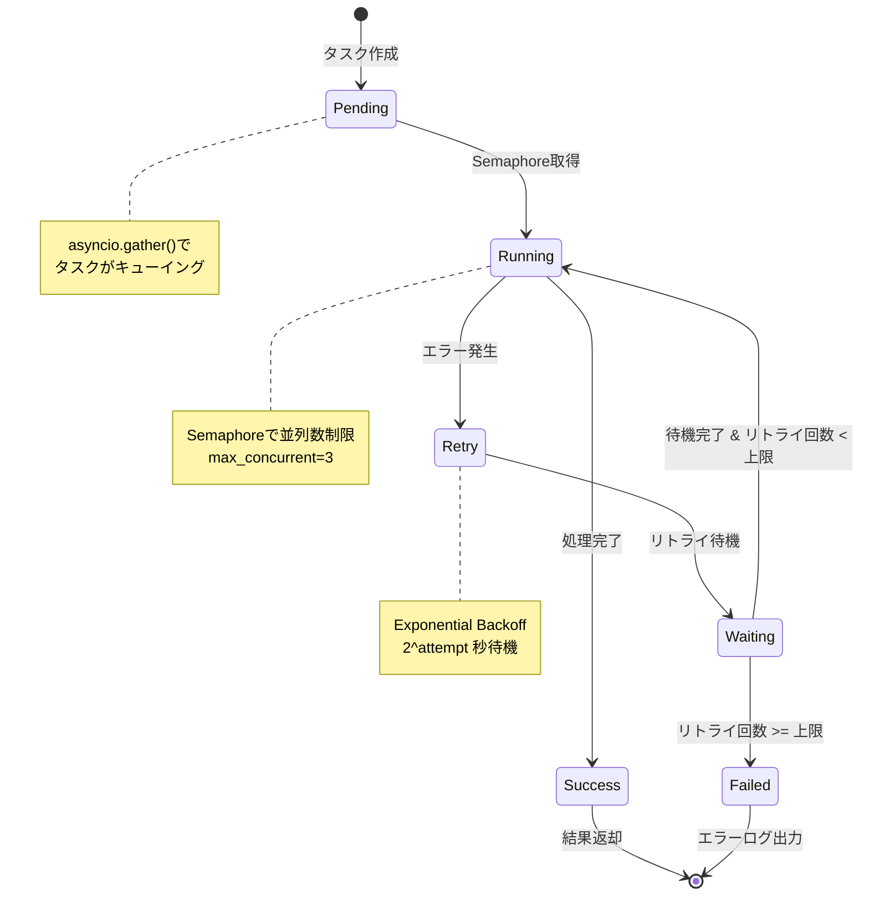
```mermaid
stateDiagram-v2
    [*] --> Pending: タスク作成

    Pending --> Running: Semaphore取得
    Running --> Success: 処理完了
    Running --> Retry: エラー発生

    Retry --> Waiting: リトライ待機
    Waiting --> Running: 待機完了 & リトライ回数 < 上限
    Waiting --> Failed: リトライ回数 >= 上限

    Success --> [*]: 結果返却
    Failed --> [*]: エラーログ出力

    note right of Pending
        asyncio.gather()で
        タスクがキューイング
    end note

    note right of Running
        Semaphoreで並列数制限
        max_concurrent=3
    end note

    note right of Retry
        Exponential Backoff
        2^attempt 秒待機
    end note
```

## 設定読み込みフロー図

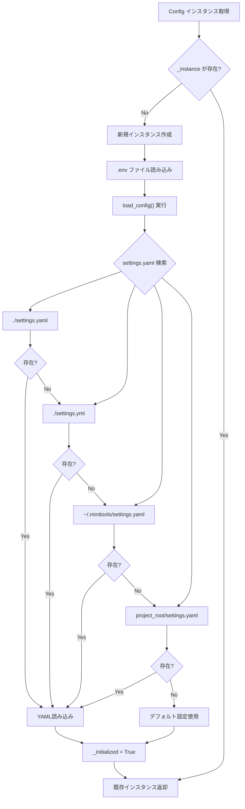
```mermaid
flowchart TB
    START["Config インスタンス取得"] --> CHECK_INSTANCE{"_instance が存在?"}
    CHECK_INSTANCE -->|No| CREATE["新規インスタンス作成"]
    CHECK_INSTANCE -->|Yes| RETURN_INSTANCE["既存インスタンス返却"]
    CREATE --> LOAD_DOTENV[".env ファイル読み込み"]
    LOAD_DOTENV --> LOAD_CONFIG["load_config() 実行"]

    LOAD_CONFIG --> SEARCH_YAML{"settings.yaml 検索"}
    SEARCH_YAML --> PATH1["./settings.yaml"]
    SEARCH_YAML --> PATH2["./settings.yml"]
    SEARCH_YAML --> PATH3["~/.minitools/settings.yaml"]
    SEARCH_YAML --> PATH4["project_root/settings.yaml"]

    PATH1 --> CHECK_EXISTS1{"存在?"}
    PATH2 --> CHECK_EXISTS2{"存在?"}
    PATH3 --> CHECK_EXISTS3{"存在?"}
    PATH4 --> CHECK_EXISTS4{"存在?"}

    CHECK_EXISTS1 -->|Yes| LOAD_YAML["YAML読み込み"]
    CHECK_EXISTS1 -->|No| PATH2
    CHECK_EXISTS2 -->|Yes| LOAD_YAML
    CHECK_EXISTS2 -->|No| PATH3
    CHECK_EXISTS3 -->|Yes| LOAD_YAML
    CHECK_EXISTS3 -->|No| PATH4
    CHECK_EXISTS4 -->|Yes| LOAD_YAML
    CHECK_EXISTS4 -->|No| USE_DEFAULT["デフォルト設定使用"]

    LOAD_YAML --> INITIALIZED["_initialized = True"]
    USE_DEFAULT --> INITIALIZED
    INITIALIZED --> RETURN_INSTANCE
```

## バッチ処理フロー図

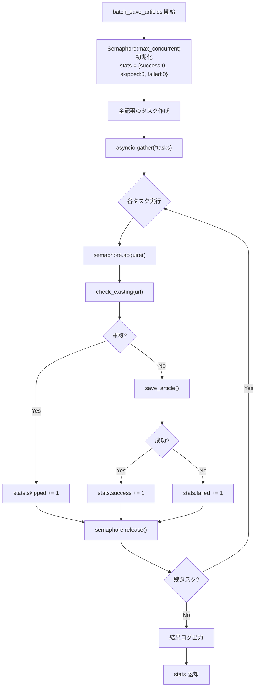
```mermaid
flowchart TB
    START["batch_save_articles 開始"] --> INIT["Semaphore(max_concurrent)初期化<br>stats = {success:0, skipped:0, failed:0}"]

    INIT --> CREATE_TASKS["全記事のタスク作成"]
    CREATE_TASKS --> GATHER["asyncio.gather(*tasks)"]

    GATHER --> TASK_LOOP{"各タスク実行"}

    TASK_LOOP --> ACQUIRE["semaphore.acquire()"]
    ACQUIRE --> CHECK_DUP["check_existing(url)"]

    CHECK_DUP --> DUP_RESULT{"重複?"}
    DUP_RESULT -->|Yes| SKIP["stats.skipped += 1"]
    DUP_RESULT -->|No| SAVE["save_article()"]

    SAVE --> SAVE_RESULT{"成功?"}
    SAVE_RESULT -->|Yes| SUCCESS["stats.success += 1"]
    SAVE_RESULT -->|No| FAIL["stats.failed += 1"]

    SKIP --> RELEASE["semaphore.release()"]
    SUCCESS --> RELEASE
    FAIL --> RELEASE

    RELEASE --> MORE_TASKS{"残タスク?"}
    MORE_TASKS -->|Yes| TASK_LOOP
    MORE_TASKS -->|No| LOG_RESULT["結果ログ出力"]

    LOG_RESULT --> RETURN["stats 返却"]
```

## バッチスコアリングフロー図

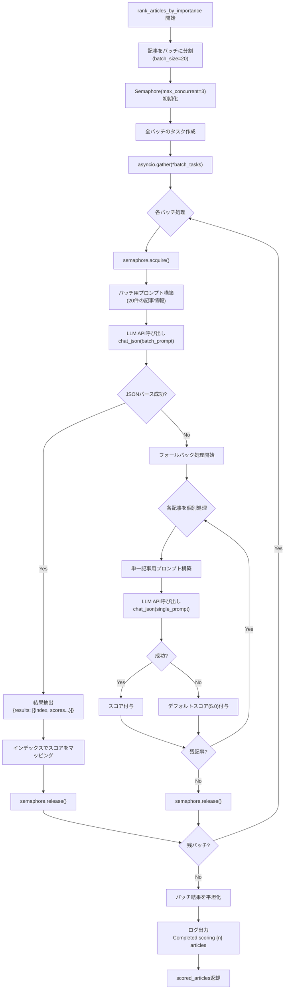
```mermaid
flowchart TB
    START["rank_articles_by_importance 開始"] --> SPLIT["記事をバッチに分割<br>(batch_size=20)"]

    SPLIT --> INIT["Semaphore(max_concurrent=3)初期化"]

    INIT --> CREATE_TASKS["全バッチのタスク作成"]
    CREATE_TASKS --> GATHER["asyncio.gather(*batch_tasks)"]

    GATHER --> BATCH_LOOP{"各バッチ処理"}

    BATCH_LOOP --> ACQUIRE["semaphore.acquire()"]
    ACQUIRE --> BUILD_PROMPT["バッチ用プロンプト構築<br>(20件の記事情報)"]
    BUILD_PROMPT --> CALL_LLM["LLM API呼び出し<br>chat_json(batch_prompt)"]

    CALL_LLM --> PARSE{"JSONパース成功?"}

    PARSE -->|Yes| EXTRACT["結果抽出<br>{results: [{index, scores...}]}"]
    EXTRACT --> MAP_SCORES["インデックスでスコアをマッピング"]
    MAP_SCORES --> RELEASE1["semaphore.release()"]

    PARSE -->|No| FALLBACK_BATCH["フォールバック処理開始"]
    FALLBACK_BATCH --> FALLBACK_LOOP{"各記事を個別処理"}

    FALLBACK_LOOP --> SINGLE_PROMPT["単一記事用プロンプト構築"]
    SINGLE_PROMPT --> SINGLE_LLM["LLM API呼び出し<br>chat_json(single_prompt)"]
    SINGLE_LLM --> SINGLE_PARSE{"成功?"}

    SINGLE_PARSE -->|Yes| SINGLE_SCORE["スコア付与"]
    SINGLE_PARSE -->|No| DEFAULT_SCORE["デフォルトスコア(5.0)付与"]

    SINGLE_SCORE --> MORE_ARTICLES{"残記事?"}
    DEFAULT_SCORE --> MORE_ARTICLES

    MORE_ARTICLES -->|Yes| FALLBACK_LOOP
    MORE_ARTICLES -->|No| RELEASE2["semaphore.release()"]

    RELEASE1 --> MORE_BATCHES{"残バッチ?"}
    RELEASE2 --> MORE_BATCHES

    MORE_BATCHES -->|Yes| BATCH_LOOP
    MORE_BATCHES -->|No| FLATTEN["バッチ結果を平坦化"]

    FLATTEN --> LOG["ログ出力<br>Completed scoring {n} articles"]
    LOG --> RETURN["scored_articles返却"]
```

## URL正規化フロー図

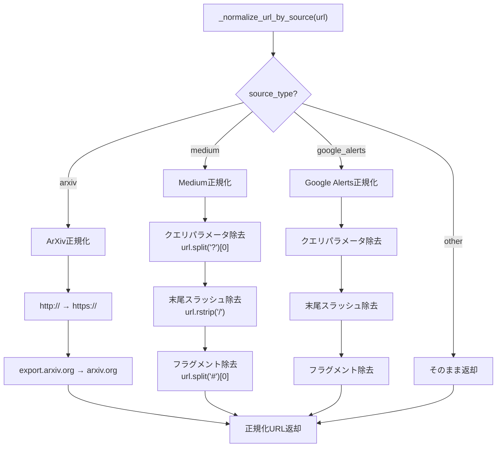
```mermaid
flowchart TB
    START["_normalize_url_by_source(url)"] --> CHECK_SOURCE{"source_type?"}

    CHECK_SOURCE -->|arxiv| ARXIV_NORM["ArXiv正規化"]
    CHECK_SOURCE -->|medium| MEDIUM_NORM["Medium正規化"]
    CHECK_SOURCE -->|google_alerts| GA_NORM["Google Alerts正規化"]
    CHECK_SOURCE -->|other| RETURN_AS_IS["そのまま返却"]

    ARXIV_NORM --> ARXIV_1["http:// → https://"]
    ARXIV_1 --> ARXIV_2["export.arxiv.org → arxiv.org"]
    ARXIV_2 --> RETURN["正規化URL返却"]

    MEDIUM_NORM --> MEDIUM_1["クエリパラメータ除去<br>url.split('?')[0]"]
    MEDIUM_1 --> MEDIUM_2["末尾スラッシュ除去<br>url.rstrip('/')"]
    MEDIUM_2 --> MEDIUM_3["フラグメント除去<br>url.split('#')[0]"]
    MEDIUM_3 --> RETURN

    GA_NORM --> GA_1["クエリパラメータ除去"]
    GA_1 --> GA_2["末尾スラッシュ除去"]
    GA_2 --> GA_3["フラグメント除去"]
    GA_3 --> RETURN

    RETURN_AS_IS --> RETURN
```

## エラーリカバリーフロー図

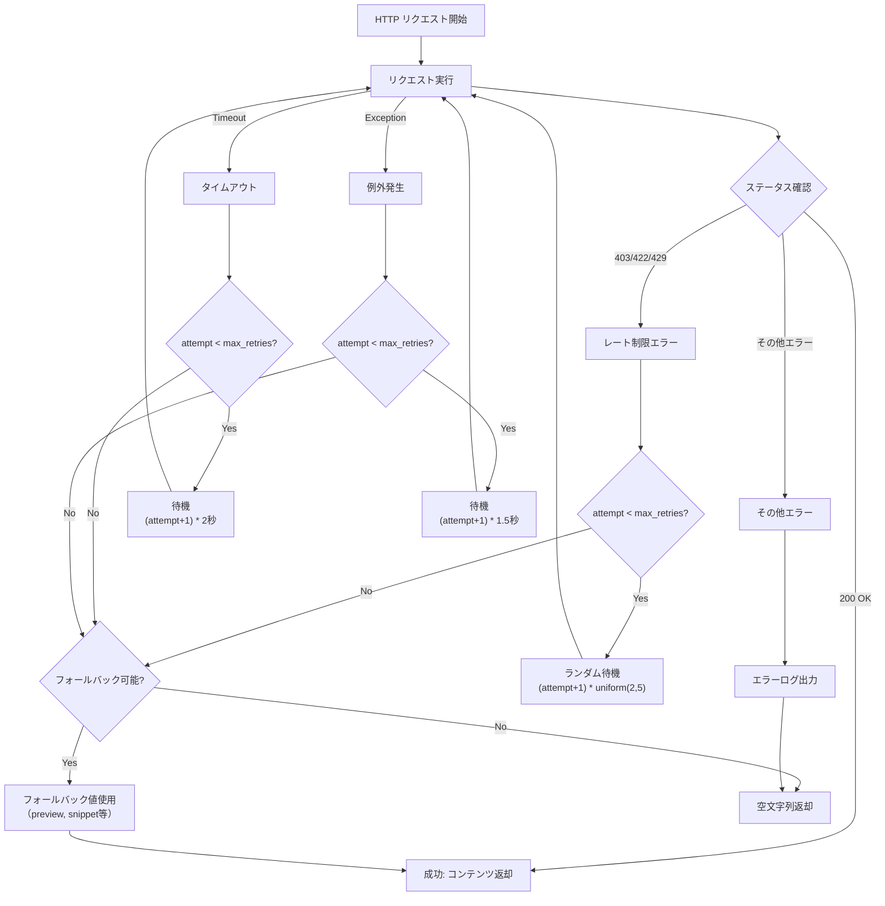
```mermaid
flowchart TB
    START["HTTP リクエスト開始"] --> TRY["リクエスト実行"]

    TRY --> STATUS{"ステータス確認"}

    STATUS -->|200 OK| SUCCESS["成功: コンテンツ返却"]
    STATUS -->|403/422/429| RATE_LIMIT["レート制限エラー"]
    STATUS -->|その他エラー| OTHER_ERROR["その他エラー"]

    TRY -->|Timeout| TIMEOUT["タイムアウト"]
    TRY -->|Exception| EXCEPTION["例外発生"]

    RATE_LIMIT --> CHECK_RETRY1{"attempt < max_retries?"}
    TIMEOUT --> CHECK_RETRY2{"attempt < max_retries?"}
    EXCEPTION --> CHECK_RETRY3{"attempt < max_retries?"}
    OTHER_ERROR --> LOG_ERROR["エラーログ出力"]

    CHECK_RETRY1 -->|Yes| WAIT1["ランダム待機<br>(attempt+1) * uniform(2,5)"]
    CHECK_RETRY1 -->|No| FALLBACK{"フォールバック可能?"}

    CHECK_RETRY2 -->|Yes| WAIT2["待機<br>(attempt+1) * 2秒"]
    CHECK_RETRY2 -->|No| FALLBACK

    CHECK_RETRY3 -->|Yes| WAIT3["待機<br>(attempt+1) * 1.5秒"]
    CHECK_RETRY3 -->|No| FALLBACK

    WAIT1 --> TRY
    WAIT2 --> TRY
    WAIT3 --> TRY

    FALLBACK -->|Yes| USE_FALLBACK["フォールバック値使用<br>（preview, snippet等）"]
    FALLBACK -->|No| RETURN_EMPTY["空文字列返却"]

    USE_FALLBACK --> SUCCESS
    LOG_ERROR --> RETURN_EMPTY
```
